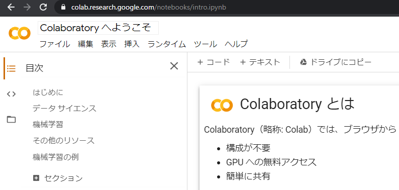
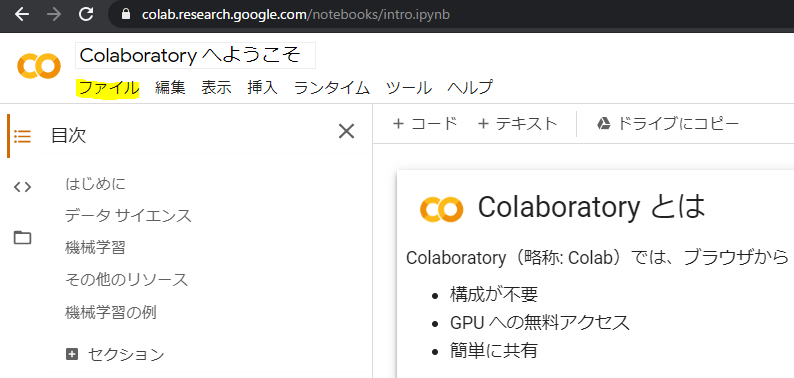
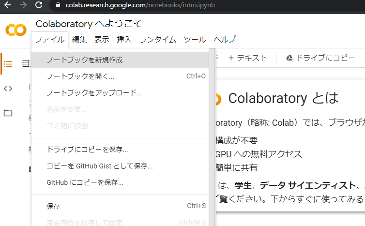
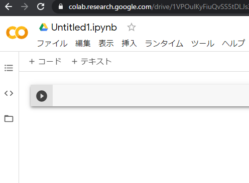
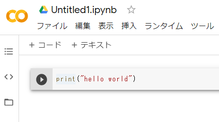
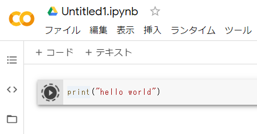
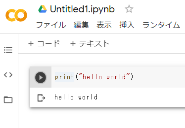

[[はじめてのGoogle Colab](./README.md)] / [[HOME](./../README.md)]

# 新しく始める
> Create New File

## 目次
> List of contents

## Google Colabのページへアクセス
まずはgoogle Colabのページへアクセスしてください。

https://colab.research.google.com/notebooks/intro.ipynb

## ノートブックの新規作成
「ファイル」から「ノートブックを新規作成」を選んでください。

## 試しに実行してみる

## 参照リンク
> Reference

[FaQ](https://research.google.com/colaboratory/faq.html)

## Pageリンク
> Page Links

- [ページTop](#目次)
- [はじめてのGoogle Colab](./README.md)
- [HOME](./../README.md)
